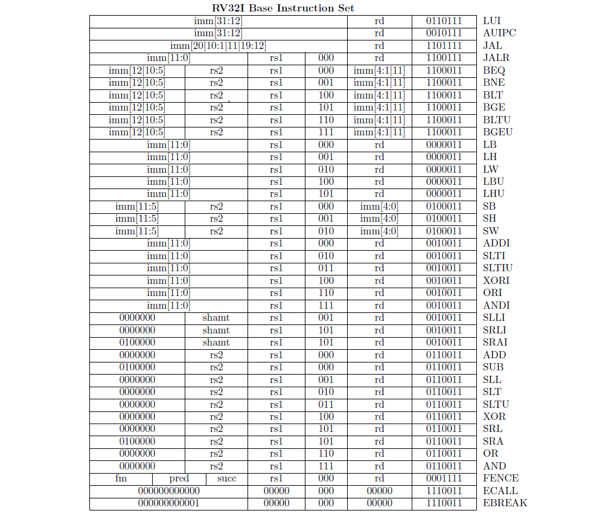

# RISC-V CPU HDL Project

This repository implements both **single-cycle** and **pipelined** RISC-V RV32I CPUs in Verilog, including memory modules, control logic, and comprehensive testbenches. The project is organized for simulation and synthesis, with modular design and memory initialization files for various instruction sets.

---

## Directory Structure

```
rtl/
  singlecycle_cpu/      # Single-cycle CPU implementation
  pipelined_cpu/        # Pipelined CPU implementation
tb/
  singlecycle_cpu/      # Testbenches for single-cycle CPU
  pipelined_cpu/        # Testbenches for pipelined CPU
  alu/                  # ALU testbenches and parameters
  memory/               # Memory and regfile testbenches
```

---

## Single-Cycle CPU ([rtl/singlecycle_cpu](rtl/singlecycle_cpu))

Implements a classic single-cycle RISC-V CPU. All instruction execution is completed in one clock cycle.

### Key Modules

- [`CPU`](rtl/singlecycle_cpu/CPU.v): Top-level CPU logic, connects all submodules.
- [`control`](rtl/singlecycle_cpu/control.v): Decodes instructions and generates control signals.
- [`alu`](rtl/singlecycle_cpu/alu.v): Arithmetic and logic operations.
- [`alucontrol`](rtl/singlecycle_cpu/alucontrol.v): Determines ALU operation based on instruction.
- [`regfile`](rtl/singlecycle_cpu/regfile.v): 32 general-purpose registers.
- [`immgen`](rtl/singlecycle_cpu/immgen.v): Immediate value extraction.
- [`dmem`](rtl/singlecycle_cpu/dmem.v): Data memory (byte-addressable, 128 bytes).
- [`imem`](rtl/singlecycle_cpu/imem.v): Instruction memory (32 words).
- [`PC`](rtl/singlecycle_cpu/PC.v): Program counter logic.

### Memory Initialization

- Instruction memory: `imem1_ini.mem`, `imem2_ini.mem`, ... (see commented versions for instruction mapping).
- Data memory: `dmem_ini.mem`.

---

## Pipelined CPU ([rtl/pipelined_cpu](rtl/pipelined_cpu))

Implements a 5-stage pipeline (IF, ID, EX, MEM, WB) for improved throughput and performance.

### Key Modules

- [`CPU`](rtl/pipelined_cpu/CPU.v): Top-level pipelined CPU logic.
- Pipeline registers: [`IF_ID`](rtl/pipelined_cpu/IF_ID.v), [`ID_EX`](rtl/pipelined_cpu/ID_EX.v), [`EX_MEM`](rtl/pipelined_cpu/EX_MEM.v), [`MEM_WB`](rtl/pipelined_cpu/MEM_WB.v).
- [`control`](rtl/pipelined_cpu/control.v): Instruction decoding.
- [`alu`](rtl/pipelined_cpu/alu.v), [`alucontrol`](rtl/pipelined_cpu/alucontrol.v): ALU and control.
- [`regfile`](rtl/pipelined_cpu/regfile.v): Register file with forwarding logic.
- [`immgen`](rtl/pipelined_cpu/immgen.v): Immediate extraction.
- [`dmem`](rtl/pipelined_cpu/dmem.v), [`imem`](rtl/pipelined_cpu/imem.v): Data and instruction memory.
- [`PC`](rtl/pipelined_cpu/PC.v): Program counter and branch logic.
- Hazard detection: [`staller`](rtl/pipelined_cpu/staller.v), [`forwarding_unit`](rtl/pipelined_cpu/forwarding_unit.v).

### Memory Initialization

- Instruction memory: `imem1_ini.mem`, `imem2_ini.mem`, ... (see commented versions for instruction mapping).
- Data memory: `dmem_ini.mem`.

---

## Testbenches ([tb](tb))

Testbenches are provided for both CPU implementations and individual modules.

- [`tb/singlecycle_cpu/cpu_tb.v`](tb/singlecycle_cpu/cpu_tb.v): Single-cycle CPU testbench.
- [`tb/pipelined_cpu/cpu_tb.v`](tb/pipelined_cpu/cpu_tb.v): Pipelined CPU testbench.
- [`tb/alu/alu_tb.v`](tb/alu/alu_tb.v): ALU testbench.
- [`tb/memory/dmem_tb.v`](tb/memory/dmem_tb.v): Data memory testbench.
- [`tb/memory/imem_tb.v`](tb/memory/imem_tb.v): Instruction memory testbench.
- [`tb/memory/regfile_tb.v`](tb/memory/regfile_tb.v): Register file testbench.

Testbenches instantiate the CPU, connect memory modules, and provide clock/reset stimulus.

---

## Instruction Set Reference



---

## How to Simulate

1. **Select the CPU variant**:
   - For single-cycle: Use [`rtl/singlecycle_cpu/cpu_tb.v`](rtl/singlecycle_cpu/cpu_tb.v) or [`tb/singlecycle_cpu/cpu_tb.v`](tb/singlecycle_cpu/cpu_tb.v).
   - For pipelined: Use [`rtl/pipelined_cpu/cpu_tb.v`](rtl/pipelined_cpu/cpu_tb.v) or [`tb/pipelined_cpu/cpu_tb.v`](tb/pipelined_cpu/cpu_tb.v).

2. **Choose instruction memory file**:
   - Edit the `$readmemh` filename in [`imem.v`](rtl/singlecycle_cpu/imem.v) or [`imem.v`](rtl/pipelined_cpu/imem.v) to select the desired program.

3. **Run simulation**:
   - Use your preferred Verilog simulator (e.g., ModelSim, Vivado, Icarus Verilog).
   - Example (Icarus Verilog):
     ```sh
     iverilog -o cpu_tb rtl/singlecycle_cpu/*.v tb/singlecycle_cpu/cpu_tb.v
     vvp cpu_tb
     ```

4. **View results**:
   - Observe register values, memory contents, and output signals to verify correct execution.

---

## Customization

- **Instruction Programs**: Add or modify `.mem` files for different test programs.
- **Data Memory**: Edit `dmem_ini.mem` for initial data values.
- **Parameters**: Adjust memory sizes or pipeline depth as needed.

---


